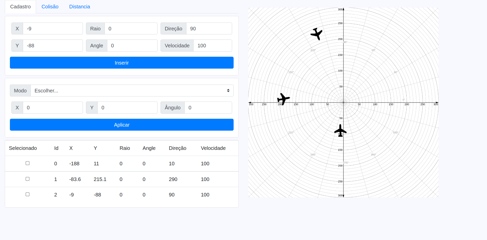
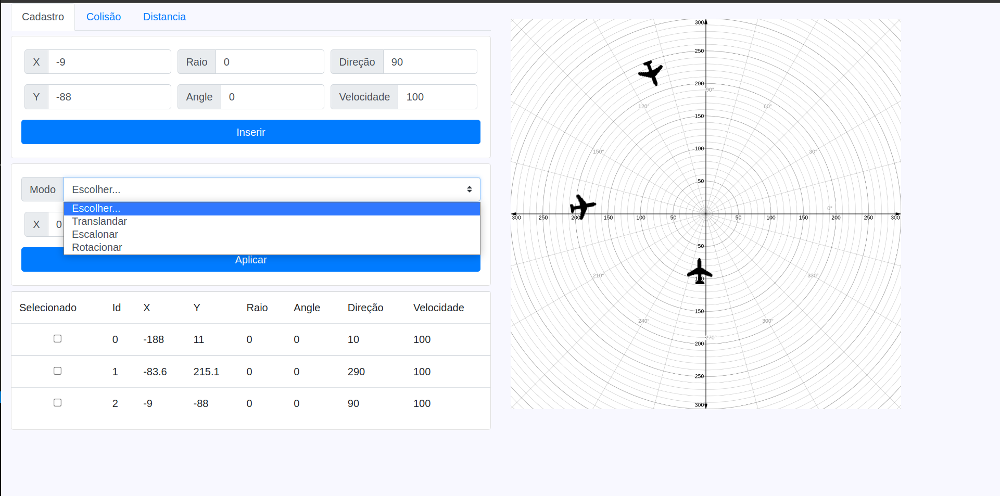

<h1 align="center">Trabalho computação grafica</h1>

Trabalho desenvolvido para a materia de Computação Grafica da UNESC

<h2 align="center">Features</h2>

### Inserções

- [x] Inserção de avião com cordenada Cartesiana

- [x] Inserção de avião com cordenada Polar

- [x] Mostrar no grafico usando cordenas Cartesianas

### Modos

- [x] Modo Translandar

- [x] Modo Escalonar

- [ ] Modo Rotacionar
    Translandar os valores informados em x e y (diminuir eles)
    aplicar a rotação 
    Translandar os valores informados em x e y (aumentar eles)

### Anotações
    Angulos que são dor de cabeça: 11 graus, 90 graus, 270 graus 

### Tabela

- [x] Mostrar os Aviões inseridos na tabela

- [x] Poder selecionar os Aviões na tabela

- [x] Aplicar os modos somente aos aviões selecionados

### Colisão 

- [ ] Calculo de ponto e tempo de colisão entre Aviões

### Distancias

- [X] Calculo de distancia entre aviões

- [x] Calculo de distacia dos aviões para o Aeroporto

### Relatorio

- [x] Relatório com todos os eventos

<h2 align="center">Imagens
  

